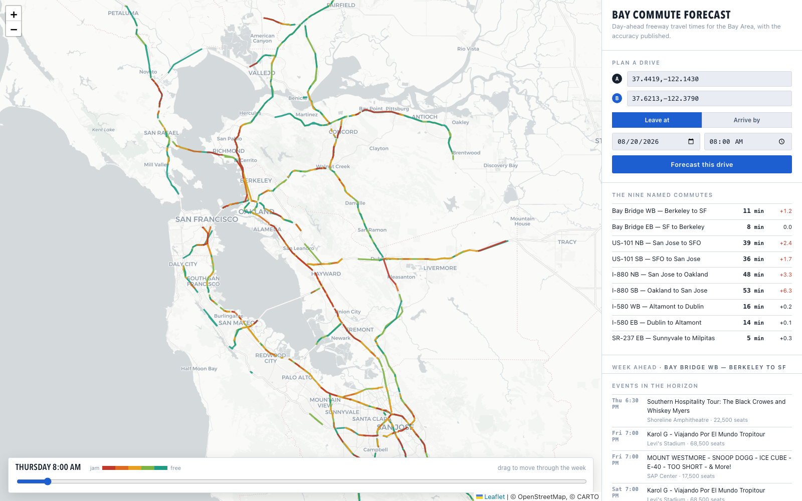

# Bay Commute Forecast

Day-ahead travel-time forecasts for Bay Area freeways. Pick an origin and a
destination, get minutes for any departure time in the next seven days, with the
model's measured accuracy published next to it.



## Accuracy

268,100 held-out 15-minute intervals, July 2025 to August 2026, on data the
model never trained on. The baseline is a seasonal profile: the same detector,
weekday and time of day averaged over history.

```
weighted MAE   1.28 min   vs 1.46 baseline   +12.1%
peak MAE       2.59 min   vs 3.12 baseline   +17.2%
```

| Corridor | mean trip | baseline | model | gain | peak gain |
|---|---:|---:|---:|---:|---:|
| Bay Bridge WB, Berkeley to SF | 8.7 | 1.227 | 1.091 | +11.1% | +15.0% |
| Bay Bridge EB, SF to Berkeley | 8.9 | 1.112 | 1.158 | -4.1% | -7.3% |
| US-101 NB, San Jose to SFO | 31.7 | 1.618 | 1.412 | +12.7% | +20.5% |
| US-101 SB, SFO to San Jose | 31.7 | 1.825 | 1.534 | +15.9% | +22.4% |
| I-880 NB, San Jose to Oakland | 39.8 | 2.304 | 1.942 | +15.7% | +21.5% |
| I-880 SB, Oakland to San Jose | 38.5 | 2.837 | 2.469 | +13.0% | +19.1% |
| I-580 WB, Altamont to Dublin | 13.1 | 0.449 | 0.430 | +4.2% | +6.1% |
| I-580 EB, Dublin to Altamont | 14.8 | 0.933 | 0.822 | +11.9% | +18.0% |
| SR-237 EB, Sunnyvale to Milpitas | 5.1 | 0.766 | 0.615 | +19.7% | +23.5% |

Bay Bridge eastbound is worse than the baseline. It has the lowest detector
coverage of the nine at 49%, and its bottleneck is the toll plaza metering,
which sits upstream of every detector on the corridor.

The gains concentrate where the baseline is weak: holidays (+17%) and congested
peak intervals (+11 to +17%). On free-flowing intervals it adds nothing,
since an average is already right. Only about 20% of total error sits in
identifiable contexts: holidays 14.8%, weather 3.0%, events 2.8%.

The model trains on 275 detectors and serves all 2,291. Detectors withheld from
training entirely score 6.1% better than baseline, against 5.5% for detectors it
did train on. A detector is described to the model by its attributes (freeway,
direction, lanes, position, segment length, its own seasonal profile) and never
by its identity.

Model selection used route MAE in minutes, not the training loss. A candidate
trained on 2.2x more data won on detector MAE in mph (2.493 vs 2.527) and lost
on minutes (1.291 vs 1.283), because corridor time is a sum of length/speed and
error on a slow detector costs more than the same error on a fast one.

## How it works

PeMS publishes 5-minute speeds for 2,291 mainline detectors in district 4.
A LightGBM model predicts each detector's speed for every 15-minute slot in the
next seven days, using its seasonal profile, calendar, gridded weather forecast,
and distance to the nearest large venue with an event on.

The horizon is knowable the night before, so inference is a nightly batch into a
1.3M-row table rather than a hosted API. A route query is then a dictionary
lookup.

For a route, OSRM finds the path and the path is matched onto the detectors it
traverses, on proximity and heading. The route is cut into spans and each is
priced by whatever evidence covers it, with the clock advancing as it goes.

Freeway spans have a detector within 530 ft pointing the same way, and are
priced from its forecast and scored. Surface spans have none, and are priced by
scaling OSRM's free-flow duration by a spread model that maps nearby freeway
congestion onto local streets. The spread model has no ground truth to fit or
score against, so surface time is excluded from every accuracy figure and drawn
as thin switchable lines on the map:

```
local_speed   = free_flow * (1 - ALPHA * (1 - freeway_ratio))
freeway_ratio = inverse-distance-squared weighted mean of forecast / free-flow
                over up to 6 detectors within 2 mi
ALPHA         = 0.5, a stated prior
```

Arrive-by is solved by searching departure times rather than subtracting, since
travel time depends on when you leave.

## Notes

Detector direction is not the direction on the shield. Caltrans signs I-580
east/west while it runs north/south through Oakland, and 19.4% of detectors sit
more than 70 degrees from their signed direction. A heading test against the
sign rejects correct matches: I-80 Berkeley to Vallejo matched 28 detectors
instead of 52. Bearings come from each detector's neighbours along its own
freeway.

PeMS imputes whole days. Some are 100% modelled and look normal in every other
way, with full detector counts and plausible speeds; `pct_observed` is the only
signal. An imputed day covering a real event teaches the model the event did
nothing.

`pct_observed` is bimodal rather than a quality gradient. A quarter of
detector-intervals sit at exactly 0 and the median is 100, so thresholding it
deletes whole segments from a corridor sum. Missing sensors then produce a lower
travel time, which looks like free-flowing traffic rather than like missing
data, so everything is scaled to full corridor length. The same trap appears one
level up: an absolute coverage threshold removed six of nine corridors from the
accuracy report, and it is now relative to each corridor's own median.

Detector `Length` does not tile the road. It averages 0.34 mi while detectors
sit 0.58 mi apart, so summing it understates freeway time by about 40%. Routing
uses spacing between consecutive detectors instead.

Weather has to be the forecast that was issued, not what happened. Open-Meteo's
Historical Forecast API keeps train and serve inputs the same kind of object;
ERA5 observations would give the model weather knowledge it never has at serve
time. It also needs a grid rather than corridor midpoints, since the network
spans 130 miles and nearest-point assignment from five locations hands a Santa
Rosa detector the weather in Oakland. Missing weather is not dry weather: the
archive starts in 2022, and filling nulls with zero asserted that 2021 was
permanently dry.

macOS `cron` skips jobs while the machine sleeps and never catches up. Two days
of roadwork history were lost before this was noticed, and Caltrans does not
publish it retrospectively. Everything runs under `launchd`.

## Running it

```bash
pip install -r requirements.txt

cat > ~/.pems_env <<'EOF'
export PEMS_USERNAME='you@example.com'
export PEMS_PASSWORD='...'
EOF
chmod 600 ~/.pems_env
set -a; . ~/.pems_env; set +a

make osrm          # one-time, needs Docker and a Bay Area OSM extract
make seasonal      # detector x weekday x slot profiles, ~40 s each
make train         # LightGBM on 9.5M readings, ~2 min on CPU
make validate      # score it in minutes on the nine corridors
make serve-data    # predict the horizon, rebuild the site JSON
make geometry      # road centrelines from the OSM extract, 5 s
make site          # http://localhost:8000

export GOOGLE_MAPS_API_KEY='...'   # place search; falls back to Photon
```

Two `launchd` agents run nightly: roadwork at 03:05 and everything else at
03:20. Roadwork is separate because Caltrans publishes current state only, so a
missed day cannot be backfilled and it must not sit downstream of anything that
can fail.

Storage is files, no database, about 1.5 GB. PeMS ships 29 MB per district-day
with no server-side filter, so the backfill downloads a day, reduces it to
740 KB, writes it and deletes the raw file.

## Layout

```
collector/     PeMS client, venue calendars, league APIs, weather, roadwork
forecast/      features, training, validation, nightly prediction
               matching.py   route polyline to detectors
               surface.py    the spread model
               route.py      origin and destination to minutes
site/          static map and week grid, plus a stdlib server for /api/route
scripts/       nightly.sh
```

## Attribution

Traffic and roadwork data courtesy of the California Department of
Transportation (Caltrans) Performance Measurement System. Weather from
[Open-Meteo](https://open-meteo.com/). Map data (c) OpenStreetMap contributors.
Basemap tiles (c) Esri, HERE, Garmin and the OpenStreetMap contributors.
Routing by [OSRM](https://project-osrm.org/).
